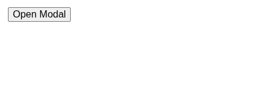
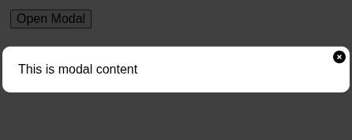

# @ouroboros/react-modal

[](https://www.npmjs.com/package/@ouroboros/react-modal) 

A React component that displays content in a box that overlays the rest of the site.

## Installation
npm
```bash
npm install @ouroboros/react-modal
```

## Using
```javascript
import Modal from '@ouroboros/react-modal';
import React, { useState } from 'react';

import '@ouroboros/react-modal/style.css';

function App(props) {
  const [ modal, modalSet ] = useState(false);

  return (
    <button onClick={() => modalSet(true)}>Open Modal</button>
    <Modal
      open={modal}
      onClose={() => modalSet(false)}
      xIcon={ <i className="fa-solid fa-circle-xmark" /> }
    >
      <div>
        <p>This is modal content</p>
      </div>
    </Modal>
  );
}
```



And then after the user clicks



## Props

| Name | Type | Required | Description |
|--|--|--|--|
| maxWidth | string \| number | no | The maximum allowable width for the modal dialog, can be sent a string as is, or a number (pixels) |
| noBackground | bool | no | Set to `true` to make the modal transparent |
| onClose | callback | no | Called when the user clicks outside the modal, or on the X `xIcon` if provided |
| open | boolean | yes | Set to true to display the modal |
| width | string \| number | no | The width to set the modal dialog, can be sent a string as is, or a number (pixels) |
| xIcon | string \| element | no | If set, whatever is passed will be displayed in the top right corner and trigger the onClose prop (if it was also passed) when clicked |

## CSS

If you want to change any aspect of the modal's styling, you can do so by modifying any of the following styles, listed from root to children.

.oc_modal, .oc_modal_outer, .oc_modal_inner, .oc_modal_inner_close, oc_modal_inner_content.

For example, if you wanted to increase the z-index of the entire modal component to 100, and also change the background color of the main content from white to a light blue.

```css
.oc_modal {
  z-index: 100;
}

.oc_modal_inner {
  background-color: rgb(121, 165, 199);
}
```